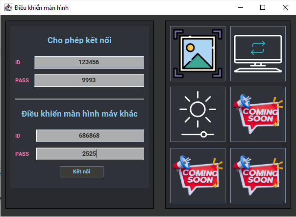
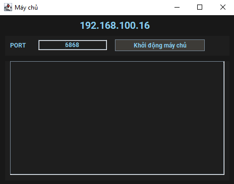
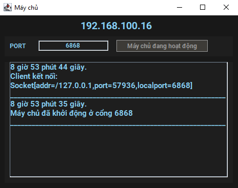
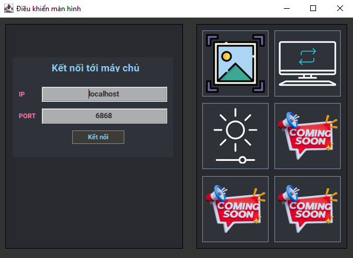
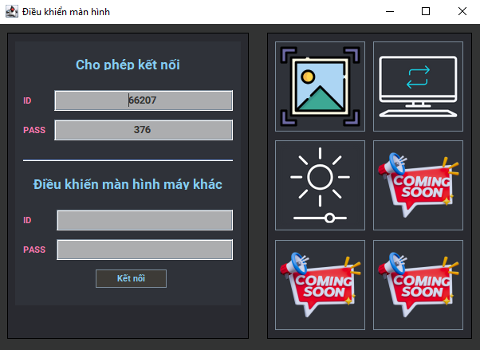

# Remote Screen Control

## Giới thiệu

Test

<p align="center">  </p>

Project mô phỏng việc sử dụng giao thức TCP, mô hình Client-Server, xây dựng chương trình điều khiển màn hình từ xa bằng Java.

Là một hệ thống gồm 1 server và nhiều client truy cập cùng 1 lúc, 1 client có thể điều khiển màn hình của 1 máy khác, 1 máy có thể cho phép nhiều máy cùng truy cập.

Cấu trúc project: 

```text
└── remote-screen-control
    ├── .gitignore
    ├── LICENSE
    ├── README.md
    ├── client
    │   ├── .gitignore
    │   ├── background.jpg
    │   └── src
    │       ├── controllers
    │       │   └── ClientController.java
    │       ├── icons
    │       │   ├── adjust_brightness.png
    │       │   ├── adjust_brightness_hover.png
    │       │   ├── change_desktop_background.png
    │       │   ├── change_desktop_background_hover.png
    │       │   ├── coming_soon.png
    │       │   ├── screen_capture.png
    │       │   └── screen_capture_hover.png
    │       ├── models
    │       │   ├── Client.java
    │       │   ├── ClientThread.java
    │       │   ├── Messager.java
    │       │   ├── Test.java
    │       │   └── User.java
    │       ├── utils
    │       │   ├── AdjustBrightness.java
    │       │   ├── ChangeDesktopBackground.java
    │       │   └── ScreenCapture.java
    │       └── views
    │           ├── ClientView.java
    │           └── NumberChooser.java
    └── server
        ├── .gitignore
        └── src
            ├── controllers
            │   └── ServerController.java
            ├── models
            │   ├── Messager.java
            │   ├── ScreenCapture.java
            │   ├── Server.java
            │   ├── ServerThread.java
            │   └── User.java
            └── views
                └── ServerView.java

```

## Các chức năng cơ bản

1. **Xác định vai trò của máy tính trong hệ thống**: Mỗi máy tính sẽ được xác định là một server hoặc một client. Server sẽ chạy trên máy tính nào đó và chịu trách nhiệm cho việc quản lý các kết nối và yêu cầu điều khiển. Client sẽ chạy trên các máy tính muốn điều khiển màn hình từ xa.

2. **Kết nối và trao đổi dữ liệu**: Các client sẽ kết nối đến server thông qua giao thức TCP/IP. Khi kết nối thành công, các client có thể gửi các yêu cầu điều khiển tới server. Server sẽ nhận các yêu cầu này, xác định máy tính mục tiêu và chuyển tiếp yêu cầu tới máy tính đó.

3. **Quản lý yêu cầu và phản hồi**: Server phải có khả năng quản lý đồng thời nhiều kết nối từ các client và xử lý các yêu cầu điều khiển tương ứng. Sau khi nhận và xử lý yêu cầu từ client, server sẽ gửi lại phản hồi cho client để thông báo về kết quả của yêu cầu.

4. **Điều khiển màn hình từ xa**: Khi server xác định máy tính mục tiêu cho một yêu cầu điều khiển, nó sẽ gửi các lệnh tương ứng tới máy tính đó. Các lệnh này có thể bao gồm chụp màn hình, thay đổi hình nên, tăng giảm độ sáng v.v.

## Cách sử dụng

### Tải project

Để tải project bạn có clone project từ github:

```
git clone https://github.com/zukahai/remote-screen-control.git
```
Hoặc tải xuống file zip [Tại đây]()

### Khởi động server

Để khởi động project, người dùng cần chạy file **ServerController.java** *(./server/src/controllers/ServerController)*

Lúc này giao diện của **Server** sẽ hiện thị như sau:

<p align="center">  </p>

Hệ thống sẽ tự lấy địa chỉ ipv4 trong mạng của máy người dùng, địa chỉ này cần dùng cho client nếu muốn kết nối tới server.

Port có thể để mặc định là *6868* hoặc có thể tuỳ chỉnh, chỉ cần đảm bảo cổng mà server mở cũng chính là cổng mà client kết nối.

Bấm nút **Khởi động máy chủ** để chạy server.
Ở giao diện Server người dùng có thể quan sát các client đã kết nối hoặc ngắt kết nối.

<p align="center">  </p>

### Khởi động các client
Để chạy một client, người dùng cần chạy file **ClientController.java** *(./client/src/controllers/ClientController)*

Giao diện client ban đầu sẽ là:

<p align="center">  </p>

Cần đảm bảo mục *PORT* phải trùng khớp với port lúc khởi động server. Phần ip các bạn cần nhập đúng dãy ip mà Server đang hiển thị. Người dùng bấm nút **Kết nối** để kết nối đến server

Sau khi kết nối thành công, server sẽ trả về cho client một tài khoản (gồm id và pass). 

<p align="center">  </p>

Hãy chia sẻ tài khoản này cho người khác, để họ có thể điều khiển màn hình máy của bạn. Ngược lại, bạn cần tài khoản của người khác nếu muốn điều khiển màn hình máy của họ.

Sau khi đã kết nối được máy người khác. Bạn hoàn toàn có thể thực hiện việc chụp ảnh màn hình, thay đổi hình desktop, thay đổi độ sáng, v.v. ở màn hình máy của họ

## Kết thúc
Trên đây là các tính năng của phần mềm "Điều khiển màn hình từ xa". Trong tương lai, phần mềm sẽ phát triển thêm các tính năng khác nhau, stream màn hình từ client này sang client khác, thay tác điều khiển client chuột.
