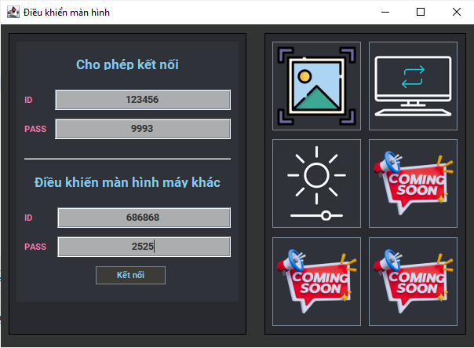

# Remote Screen Control

  

## Giới thiệu

Sử dụng giao thức TCP, mô hình Client-Server, xây dựng chương trình điều khiển màn hình từ xa bằng Java.

Là một hệ thống gồm 1 server và nhiều client truy cập cùng 1 lúc, 1 client có thể điều khiển màn hình của 1 máy khác, 1 máy có thể cho phép nhiều máy cùng truy cập.

## Các chức năng cơ bản

1. **Xác định vai trò của máy tính trong hệ thống**: Mỗi máy tính sẽ được xác định là một server hoặc một client. Server sẽ chạy trên máy tính nào đó và chịu trách nhiệm cho việc quản lý các kết nối và yêu cầu điều khiển. Client sẽ chạy trên các máy tính muốn điều khiển màn hình từ xa.

2. **Kết nối và trao đổi dữ liệu**: Các client sẽ kết nối đến server thông qua giao thức TCP/IP. Khi kết nối thành công, các client có thể gửi các yêu cầu điều khiển tới server. Server sẽ nhận các yêu cầu này, xác định máy tính mục tiêu và chuyển tiếp yêu cầu tới máy tính đó.

3. **Quản lý yêu cầu và phản hồi**: Server phải có khả năng quản lý đồng thời nhiều kết nối từ các client và xử lý các yêu cầu điều khiển tương ứng. Sau khi nhận và xử lý yêu cầu từ client, server sẽ gửi lại phản hồi cho client để thông báo về kết quả của yêu cầu.

4. **Điều khiển màn hình từ xa**: Khi server xác định máy tính mục tiêu cho một yêu cầu điều khiển, nó sẽ gửi các lệnh tương ứng tới máy tính đó. Các lệnh này có thể bao gồm chụp màn hình, thay đổi hình nên, tăng giảm độ sáng v.v.

## Cách thức hoạt động
